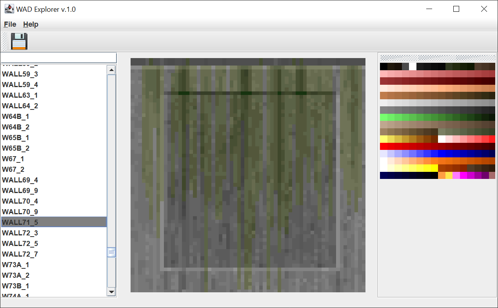

Doom/Doom2 WAD file viewer and editor.

Currently can
-
- Open and parse IWAD/PWAD files structure, show as a tree.
- Parse and show the PALETTE.
- Parse and show graphics files; take palette from IWAD to PWAD to see images.
- Extract and save files.
- Save graphics files in GIF format with palette.

Plans
- 
- New / Edit / Save PWAD files
- Take IWAD entries to opened PWAD files.
- Show palette usage histogram for graphics files.

Release 1.0.3
-
- Open PWAD files (mods)
- Open files in separate tabs
- Option for PWAD files w/o palette: clone palette from another WAD to show images.

