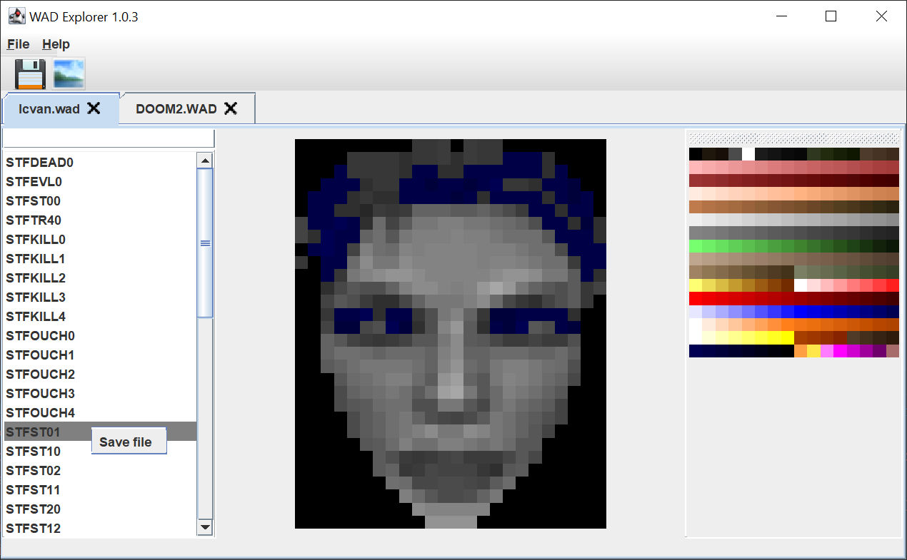

Doom/Doom2 WAD file viewer and editor.

Currently can:
- Open and parse IWAD files structure, show as a tree
- Parse and show the PALETTE
- Parse and show graphics files
- Save graphics files in GIF format with palette.

Plans:
- Open PWAD files (mods)
- Open files in separate tabs
- New / Edit / Save PWAD files
- Take IWAD entries to opened PWAD files.
- Show palette usage histogram for graphics files.

